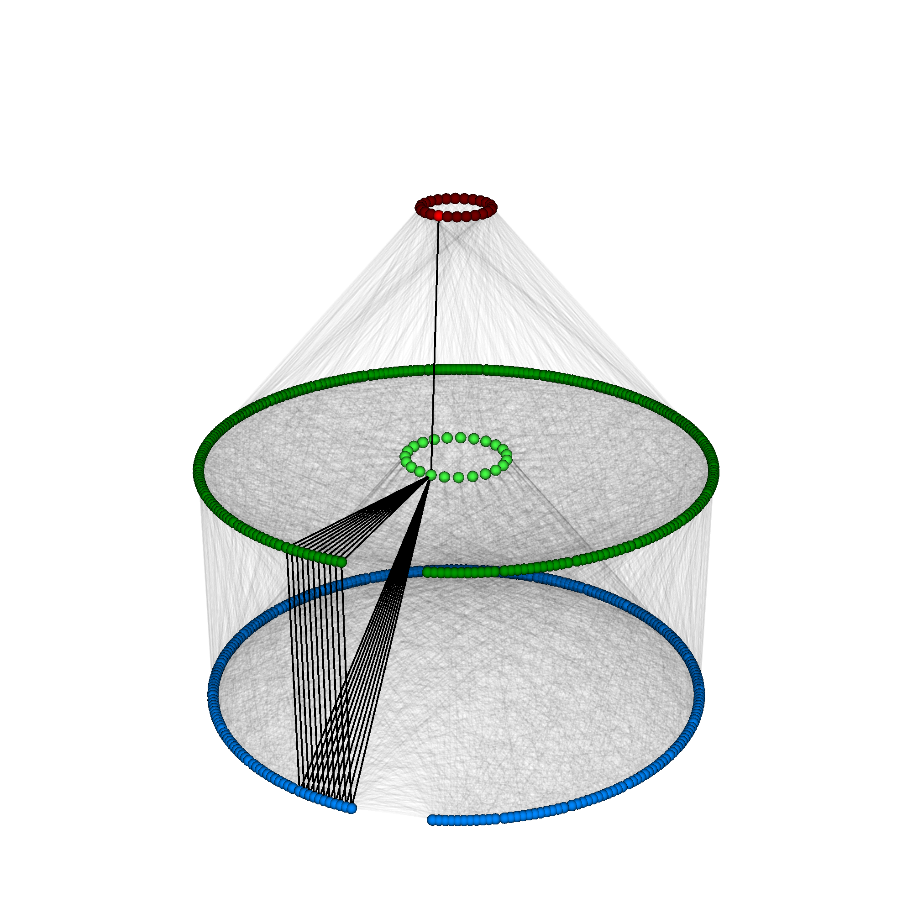
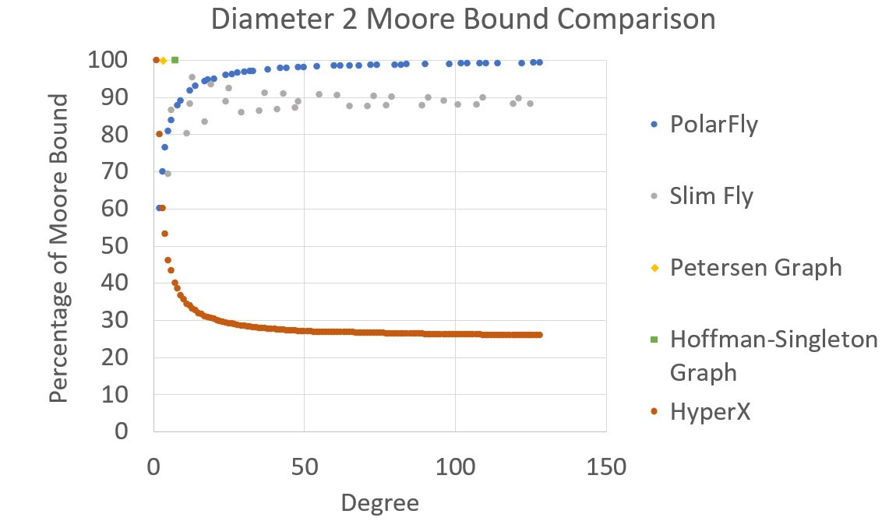
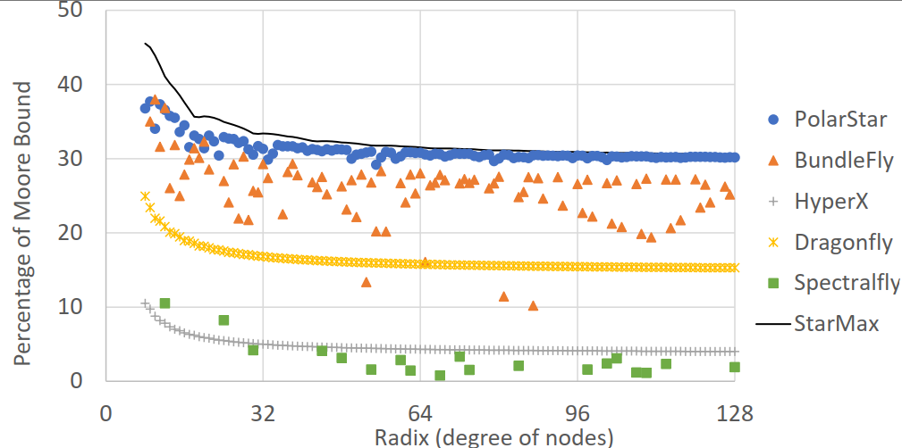

# PolarFly and PolarStar 
||
|:--:|
|**PolarFly Topology with 553 routers of radix 24 each (q=23). Black edges highlight a rack of PolarFly**.|

Members: Kartik Lakhotia, Maciej Besta, Laura Monroe, Kelly Isham, Patrick Iff, Nils Blach, Torsten Hoefler, Fabrizio Petrini

## Introduction

### PolarFly
PolarFly is a diameter-2 network topology based on the 
Erdos-Renyi family of polarity
graphs.  
PolarFly is the first known diameter-2
topology that asymptotically reaches the  
(optimal) Moore bound on the
number of nodes for a given network degree and diameter.  

PolarFly is flexible -- offers large number of feasible degrees
including some of particular interest   
from a technological perspective, such as, 24, 32, 48, 62, 128.  
It has a modular and extensible design which allows incremental
network growth without rewiring.

||
|:--:|
|**Moore Bound Comparison of PolarFly and other diameter-2 topologies**|

### Polarstar
Polarstar is a diameter-3 network topology based on star product of Erdos-Renyi graphs with
Paley or Inductive Quad graphs.  
PolarStar achieves the highest scale among all known diameter-3 graphs for several radixes.

||
|:--:|
|**Moore Bound Comparison of Polarstar and other diameter-3 topologies**|

## Directory Structure
- **booksim** - Network simulator by Jiang et al., modified for PolarFly and Slim Fly
- **topologies** - Generate network topologies (in adjacency list format)
- **scripts** - Script to generate simulation results (compile, generate topology and run injection rate sweeps) reported in the paper.

Each directory has READMEs with corresponding instructions.

## Requirements
- C++11 - for BookSim)
- lex, yacc (bison and flex packages)
- Python3.x - for topology generation and simulation sweeps
- NumPy, SciPy, SymPy, R (sqldf, ggplot2) - for topology generation
- joblib - to parallelize simulation sweeps

## References 

1. Nan Jiang, Daniel U. Becker, George Michelogiannakis, James Balfour, Brian Towles, John Kim and William J. Dally. "A Detailed and Flexible Cycle-Accurate Network-on-Chip Simulator." Proceedings of the 2013 IEEE International Symposium on Performance Analysis of Systems and Software, 2013 [Code](https://github.com/booksim/booksim2).

2. P. Erdos and A. Renyi. "On a problem in the theory of graphs." The Mathematical Gazette, 1963.

3. W. G. Brown. "On graphs that do not contain a Thomsen graph." Canadian Mathematical Bulletin, 1966.

4. M. Besta and T. Hoefler. "Slim Fly: A cost effective low-diameter network topology." Proceedings of the International Conference for igh performance computing, networking, storage and analysis, 2014.

5. Lakhotia, Kartik, Maciej Besta, Laura Monroe, Kelly Isham, Patrick Iff, Torsten Hoefler, and Fabrizio Petrini. "Polarfly: A cost-effective and flexible low-diameter topology." Proceedings of the International Conference on High Performance Computing, Networking, Storage and Analysis, 2022.

6. Lakhotia, Kartik, Laura Monroe, Kelly Isham, Maciej Besta, Nils Blach, Torsten Hoefler, and Fabrizio Petrini. "PolarStar: Expanding the Scalability Horizon of Diameter-3 Networks." arXiv preprint arXiv:2302.07217, 2023.
